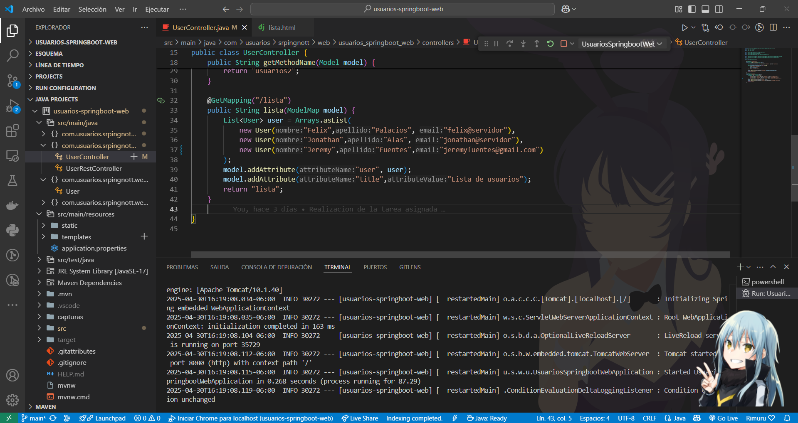
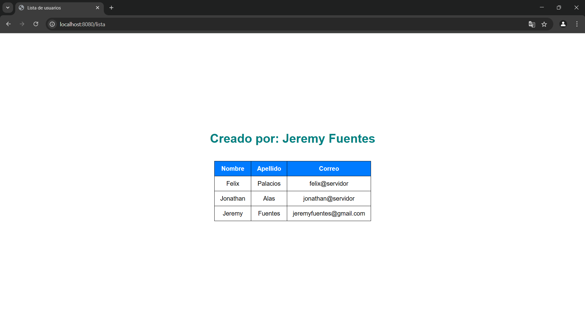
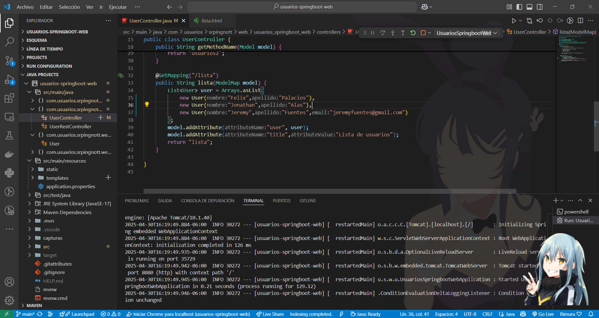
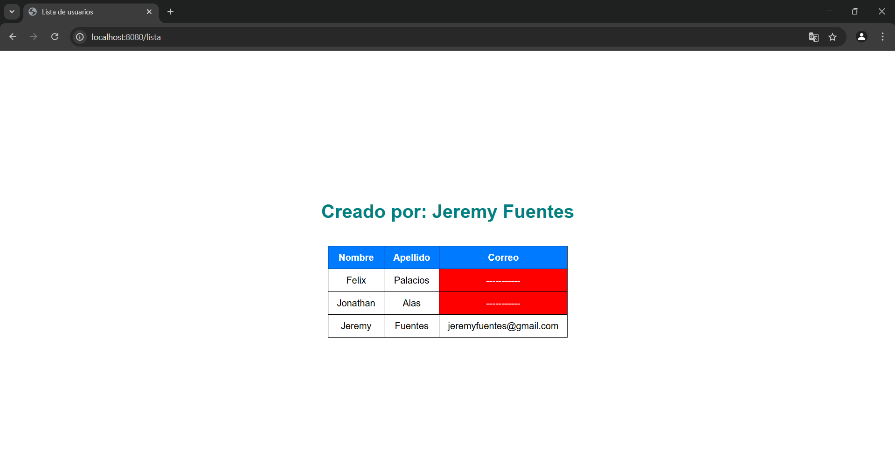
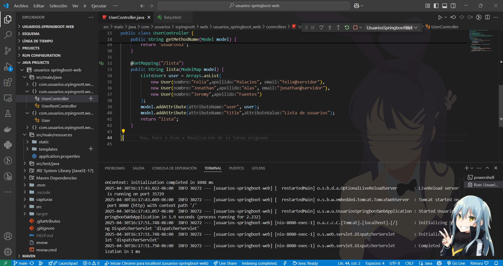
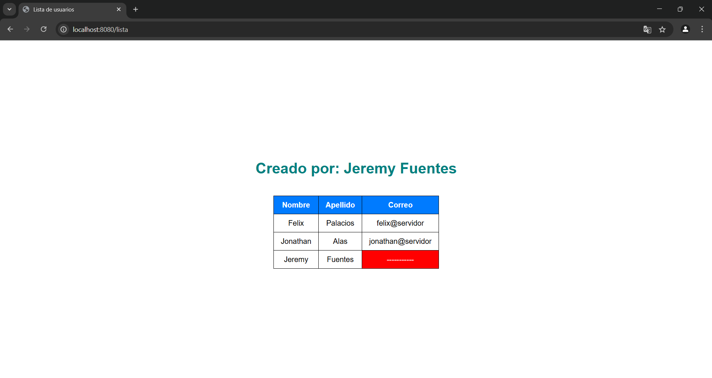
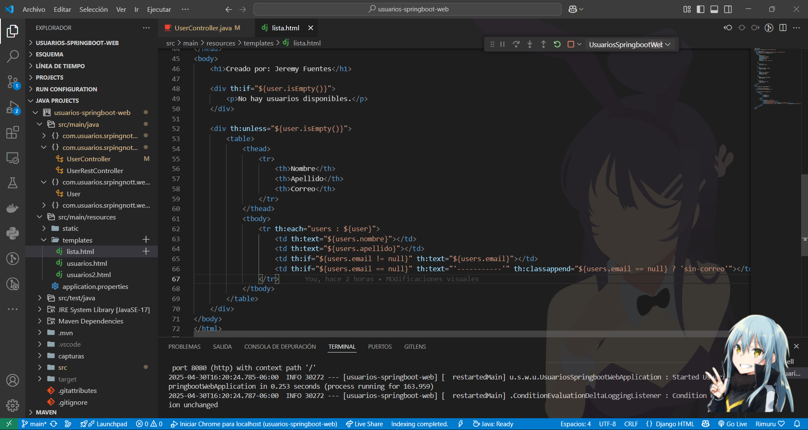

# 📄 Proyecto: Lista de Usuarios - Spring Boot + Thymeleaf

## ✨ Descripción

Esta es una aplicación web desarrollada con **Spring Boot** y **Thymeleaf** que muestra una lista de usuarios con su nombre, apellido y correo electrónico.  
La lista de usuarios es simulada dentro de un servicio.  
Si el correo electrónico de algún usuario es `null`, se muestra `"--------"` en su lugar.

## 🛠️ Tecnologías utilizadas

- Java 17+ ☕
- Spring Boot 3.4.5 🌱
- Thymeleaf 🌿
- Maven 📦

## 🚀 Instrucciones para ejecutar el proyecto

1. **Clona o descarga** este repositorio o descomprime la carpeta del proyecto.
2. Abre el proyecto en tu IDE favorito (**IVisual Estudio Code (Utilizado de mi parte)**, **Spring Tool Suite**, **Eclipse**, etc.).
3. Asegúrate de tener instalado **Java 17** o superior.
4. Ejecuta la aplicación desde la clase principal (con `@SpringBootApplication`).
5. Abre tu navegador y visita:
   ```
   http://localhost:8080/lista
   ```
6. ¡Listo! Verás una tabla dinámica mostrando los usuarios.

## 🗂️ Estructura del Proyecto

- `model/User.java` ➔ Clase que representa a un usuario.
- `service/UserService.java` ➔ Servicio que contiene la lista simulada.
- `controller/UserController.java` ➔ Controlador que maneja las peticiones.
- `templates/lista.html` ➔ Plantilla Thymeleaf para la tabla de usuarios.

## 📸 Capturas de Pantalla

**Vista general de la lista de usuarios:**




**Usuarios con correos electrónicos nulos mostrando '--------':**




**MOdificacion de usuarios con correo nulo




**Vista del html configurado para la pagina**


## 📚 Notas

- Se utiliza `th:each` para iterar sobre la lista de usuarios.
- Se utiliza `th:text` para mostrar los valores.
- Se utiliza `th:if` para validar el correo electrónico nulo.

---

👨‍💻 Hecho con mucho esfuerzo para la tarea de programación.
